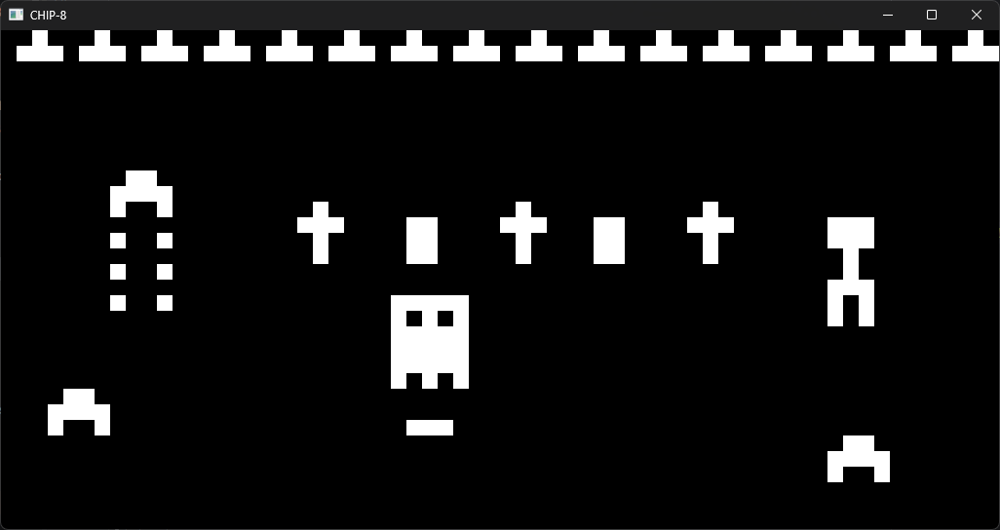

# rusty-chip-8

A [CHIP-8](https://en.wikipedia.org/wiki/CHIP-8) emulator written in Rust, built by following [Tobias V. Langhoff's "Guide to making a CHIP-8 emulator"](https://tobiasvl.github.io/blog/write-a-chip-8-emulator/).



## Introduction

`rusty-chip-8` implements the full CHIP-8 instruction set, including quirk handling for opcodes whose behaviour is ambiguous across the original implementations (shifts, jumps with offset, `I` register overflow and memory load/store). The delay and sound timers run on their own threads, counting down independently of the main emulation loop.

The emulator core is UI-agnostic: it runs on a dedicated thread and communicates with the frontend purely through message channels (display updates out, key events in). The current frontend is built on [`winit`](https://github.com/rust-windowing/winit) for windowing/input and [`softbuffer`](https://github.com/rust-windowing/softbuffer) for pixel rendering.

Correctness was checked against [Timendus' CHIP-8 test suite](https://github.com/Timendus/chip8-test-suite) as well as self-written unit tests covering the individual opcodes.

## Installation and Compilation

### Prerequisites

- [Rust](https://www.rust-lang.org/tools/install) 1.85 or later (the project uses the 2024 edition)

Developed and tested on Windows 11 and Ubuntu.

### Building

```sh
git clone https://github.com/kubapoke/rusty-chip-8.git
cd rusty-chip-8
cargo build --release
```

### Running the tests

```sh
cargo test
```

## Usage

```sh
cargo run --release
```

> **Note:** ROM loading is not yet configurable - the emulator currently always loads `programs/test_opcode.ch8`. See [TODO](#TODO) below.

### Controls

CHIP-8 programs expect a 16-key hexadecimal keypad. It is mapped to the keyboard as follows:

| | | | |
|---|---|---|---|
| `1` | `2` | `3` | `4` |
| `Q` | `W` | `E` | `R` |
| `A` | `S` | `D` | `F` |
| `Z` | `X` | `C` | `V` |

which corresponds to the original keypad layout:

| | | | |
|---|---|---|---|
| `1` | `2` | `3` | `C` |
| `4` | `5` | `6` | `D` |
| `7` | `8` | `9` | `E` |
| `A` | `0` | `B` | `F` |

## TODO

- Load ROMs via a command-line argument.
- Make ambiguous opcode behaviour configurable instead of using fixed defaults.
- Refactor error handling throughout the application.

## License

Licensed under the [MIT License](LICENSE).
